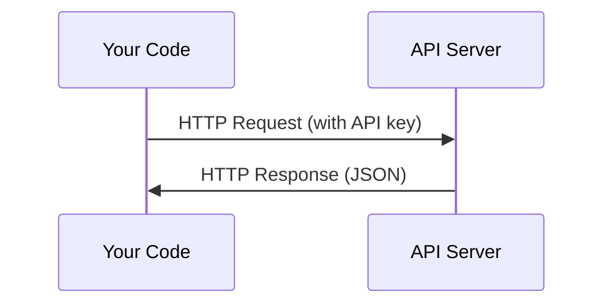

# APIs & Keys

> Every AI API works the same way: send a request, get a response. The details change, the pattern doesn't.


## Learning Objectives

- Store API keys securely using environment variables and `.env` files
- Make an LLM API call using both the Anthropic Python SDK and raw HTTP
- Compare SDK-based and raw HTTP request/response formats for debugging
- Identify and handle common API errors including authentication and rate limits


## The Concept



Every API call has:
1. An endpoint (URL)
2. An API key (authentication)
3. A request body (what you want)
4. A response body (what you get back)

## Build It

### Step 1: Store API keys safely

Never put API keys in code. Use environment variables.

```bash
export ANTHROPIC_API_KEY="sk-ant-..."
export OPENAI_API_KEY="sk-..."
```

Or use a `.env` file (add it to `.gitignore`):

```
ANTHROPIC_API_KEY=sk-ant-...
OPENAI_API_KEY=sk-...
```

### Step 2: First API call (Python)

```python
import os
from dotenv import load_dotenv
from groq import Groq

# Load environment variables from .env
load_dotenv()

# Initialize the client (it automatically look for the GROQ_API_KEY variable in .env folder)

client = Groq()

try:
    completion = client.chat.completions.create(
        model='llama-3.3-70b-versatile',
        messages=[
            {
                'role' : "user",
                'content' : 'Give me one word answer for capital of India.'
            }
        ],
        temperature=0.1,
    )

    print("\n--- Response ---")
    print(completion.choices[0].message.content)

except Exception as e:
    print(f"Error: {e}")

```

